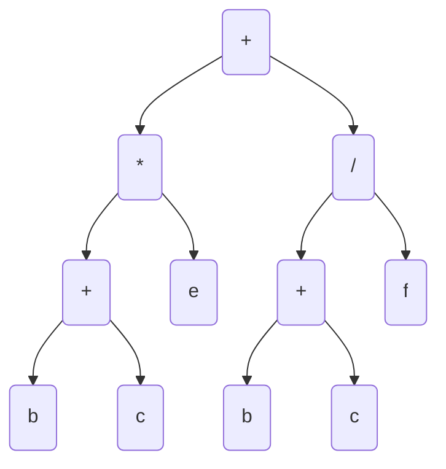

### 编译原理 -Assignment 4

---

**Q1:**列举三种编译器构造中的三种中间语言：**Parse Tree**, **Abstract Syntax Tree**,**three address code**

---

**Q2:** 给定数组int a, 按行优先的方式存放在起始于base的一片连续单元中，数组下标从0开始，每个元素的字节数为4，a[i]的起始地址为 **&a + 4 * i**

---

**Q3:** 以短路计算方式生成布尔表达式的中间代码时，跳转目标地址尚未确定，可使用（__回填__）技术避免多遍扫描

---

**Q4:** 将下列语句翻译为抽象语法树(AST)、四元式、三元式与间接三元式 

$$a:=(b+c)*e+(b+c)/f$$

1. **AST**



$$
t_1 = b + c\\
t_2 = t_1 * e \\
t_3 = t_1 / f \\
t_4 = t_2 + t_3 \\
a = t_4
$$

2. **四元式**

|      | $$op$$ | $$arg_1$$ | $$arg_2$$ | $$result$$ |
| ---- | ------ | --------- | --------- | ---------- |
| (0)  | +      | b         | c         | $$t_1$$    |
| (1)  | *      | $$t_1$$   | e         | $$t_2$$    |
| (2)  | /      | $$t_1$$   | f         | $$t_3$$    |
| (3)  | +      | $$t_2$$   | $$t_3$$   | $$t_4$$    |
| (4)  | =      | $$t_4$$   |           | a          |

3. 三元式

|      | $$op$$ | $$arg_1$$ | $$arg_2$$ |
| ---- | ------ | --------- | --------- |
| (0)  | +      | b         | c         |
| (1)  | *      | (0)       | e         |
| (2)  | /      | (0)       | f         |
| (3)  | +      | (1)       | (2)       |
| (4)  | =      | a         | (3)       |

4. 间接三元式

| step | instruction |
| ---- | ----------- |
| 0    | (0)         |
| 1    | (1)         |
| 2    | (2)         |
| 3    | (3)         |
| 4    | (4)         |

| $$index$$ | $$op$$ | $$arg_1$$ | $$arg_2$$ |
| --------- | ------ | --------- | --------- |
| (0)       | +      | b         | c         |
| (1)       | *      | (0)       | e         |
| (2)       | /      | (0)       | f         |
| (3)       | +      | (1)       | (2)       |
| (4)       | =      | a         | (3)       |

---

**Q5:** 给定一个5 x 6的二维数组a， a中的每个元素大小为 4 字节 (bytes)。请给出$$i = a[3][2]$$的四元式
$$
t_1 = 3 * 6 \\
t_2 = t_1 + 2 \\
t_3 = t_2 * 4 \\
t_4 = a[t_3] \\
i = t_4
$$

|      | $$op$$ | $$arg_1$$ | $$arg_2$$ | $$result$$ |
| ---- | ------ | --------- | --------- | ---------- |
| (0)  | *      | 3         | 6         | $$t_1$$    |
| (1)  | +      | $$t_1$$   | 2         | $$t_2$$    |
| (2)  | *      | $$t_3$$   | 4         | $$t_3$$    |
| (3)  | []     | a         | $$t_3$$   | $$t_4$$    |
| (4)  | =      | $$t_4$$   |           | i          |

---

**Q6:** 给定数组$$A[i, j]$$，i 的值域为1-10， j 的值域为1-20。a中的每个元素大小为4 字节 (bytes)。假设A的起始地址为0，求 $$A[4,5]$$ 和 $$A[10,8]$$的地址

$$A[4,5]$$地址为 $$0+4*(4-1)*20+4*(5-1)$$

$$A[10,8]$$地址为 $$0+4*(10-1)*20+4*(8-1)$$

---

**Q7:** 使用英文教材411页的SDT，补全 x < 100 || (y > 200 && x != y) 的翻译结果，并说明回填依据与尚不能回填的代码地址的含义


```
100: if x < 100 goto _
101: goto _
102: if y > 200 goto _
103: goto _
104: if x != y goto_
105: goto _
```

回填：

104回填到指令102，在归约$$B\rightarrow B_1\ \&\&\ M\ B_2 $$时，$$backpatch(B_1.truelist,M.instr)$$，其中$$B_1.truelist={102},M.instr=104$$

```
100: if x < 100 goto _
101: goto _
102: if y > 200 goto 104
103: goto _
104: if x != y goto_
105: goto _
```

102回填到指令101,同样在归约$$B\rightarrow B_1\ ||\ M\ B_2 $$时，$$backpatch(B_1.falselist,M.instr)$$，其中$$B_1.falselist={101},M.instr=102$$

```
100: if x < 100 goto _
101: goto 102
102: if y > 200 goto 104
103: goto _
104: if x != y goto_
105: goto _
```

尚不能回填的代码地址的含义：当100： x < 100时，这段表达式为真，103：y <= 200时这段表达式为假，104：x  != y时，表达式为真，105：x == y时表达式为假，这段表达式都获得确定的真值，回填的内容需要由后续其他的汇编过程决定，也就是根据表达式的真假决定要做什么。
